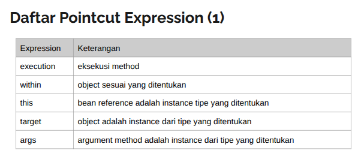
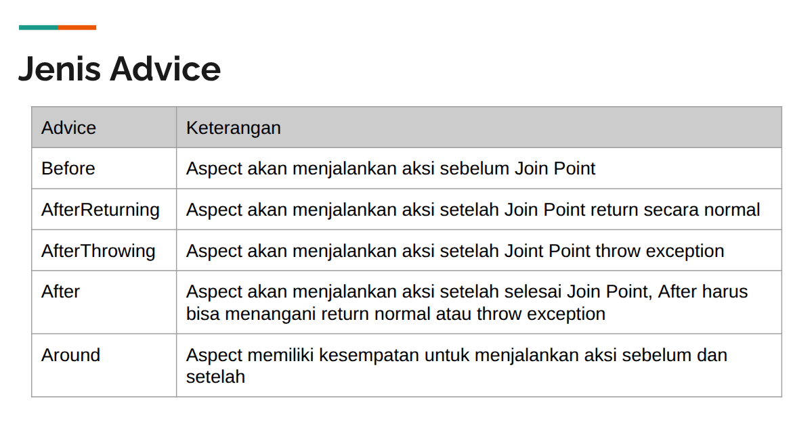
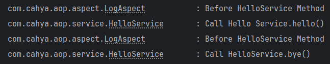

# Spring AOP - Aspect-Oriented Programming

### url

> 1pQ5k5SqbZyoNJilrDF5cvRVDa0611FPvdB5ADKKPTpE

```
- AOP melengkapi OOP dalam membuat kode program.
- OOP => inti dari modularity kode adalah class
- AOP => inti dari modularity kode adalah aspect
- Aspect memungkinkan modularity daro concerns (perhatian), 
  yang bisa melintasi berbagai jenis tipe data dan object.
  
2 fitur OOP:
- Spring AOP sendiri
- Library AOP => AspectJ
```

## AspectJ

```
-AspectJ adalah libarary AOP yang banyak digunakan untuk implementasi AOP di Java.
```

> Contoh membuat kode prorgram tanpa AOP dulu (agar nanti tau perbedaannya).

```
1. Buat Service class
   package com.cahya.aop.service; => folder main
2. Buatkan package service dan class HelloServiceTest.java
   package com.cahya.aop.service; => folder test, class HelloServiceTest 
result setelah running = lognya sudah di panggil:
```

> 

> Bayangkan jika method terus bertambah, kita harus membuat log terus secara manual.
> Apa yang harus dilakukan?
> > Lihat jika polanya sama, kita bisa gunakan AOP untuk mengatasi masalah ini.
> > AOP memungkinkan kita membuat Aspect yang melintasi semua method dari object tersebut.
> > Dimana di aspectnya, kita perlu MENULIS kode untuk log satu kali saja.

## Mengaktifkan AOP

```
- Default Spring Boot tidak mengaktifkan AOP.
- Untuk mengaktifkan AOP secara manual menggunakan annotation @EnableAspectJAutoProxy
- Kita bisa tambahkan do Bean Configuration agar fitur AOP aktif.
```

> Contoh: padaca class SpringAopApplication.java
> Tambahkan annotation @EnableAspectJAutoProxy
> Kemudian coba running unit test HelloServiceTest.java

## Aspect

```
- INTI dari AOP adalah Aspect.
- Sehingga kita harus membuat Aspect terlebih dahulu.
- Untuk membuat Aspect, 
  cukup membuat Bean dan menambahkan annotaton Aspect pada Bean tersebut.
- Otomatis Spring akan membuatkan object Aspect dari class tersebut.
```

> Contoh:
> > 1. Membuat class LogAspect.java, yang dijadikan bean dengan annotation @Component
> > 2. Dan jika ingin menjadikan class tersebut sebagai Aspect, tinggal tambahkan annotation @Aspect
> > 3. Step 1 dan 2 berada dalam pacakege aspect di class LogAspect.

```
- Secara default, Aspect tidak berguna jika tidak menambahkan behavior pada Aspect tersebut.
- Untuk menabahkan behaviour ke Aspect, dilakukan dengan menambhakan method pada Aspect tersebut.

Ketentukan method pada Aspect:
1. ada pointcut
2. ada advice
```

## Join Point - titik lokasi eksekusi program

```
- Joint point adalah titik lokasi eksekusi program.
-  AspectJ sebenarnya mendukung Join Point, 
   namun Spring AOP hanya mendukung Join Point pada method di bean.
```

> 

## Pointcut

```
- Pointcut adalah predikat yang cocok dengan Join Point.
- Poincut merupakan kondisi yang digunakan untuk menentukan Join point.
- Ketika kondisi terpenuhi, maka Aspect akan mengeksekusi Advice.
- Untuk membuat pointcut, kita perlu menggunakan annotation @Pointcut.
- setiap membuat pointcut, kita harus menentukan kondisi Join Point yang akan digunakan.
```

> Contoh: di class LogAspect.java
> tambahkan method dengan annotation @Pointcut

## Pointcut Expression

```
- Saat membuat pointcut, maka kita harus menambahkan 
  expression yang berisi kondisi untuk Join Pointnya.
- Misal kita ingin membuat Pointcut untuk semua method di class HelloService. 
  Maka harus membuat kondisi dalam bentuk pointcut expression.
- AspectJ mendukung Pointcut Expression TAPI Spring AOP
  hanya mendukung yang berhubungan dengan eksekusi method.
- Karena Spring AOP hanya akan berjalan di Bean saja, Class yang ditadai dengan @Component.
```

> 
> > Contoh jika ingin membuat pointcut untuk semua (Method di class HelloService)
> > ```
> > // Untuk menyebutkan nama kelasnya harus full dengan nama packagenya.
> > @Pointcut("targer(com.cahya.aop.service.HelloService)")

## Advice

```
- Advice adalah aksi yang dilakukan oleh Aspect pada Join Point.
- Terdapat beberapa jenis Advice:
  1. Before Advice => sebelum method dieksekusi
  2. After Advice => setelah method dieksekusi
  3. After Returning Advice => setelah method dieksekusi dan BERHASIL
  4. After Throwing Advice => setelah method dieksekusi dan GAGAL
  5. Around Advice => sebelum dan sesudah method dieksekusi
```

## Advice Parameter

```
- Saat membuat Advice, kita bisa mendapatkan informasi dari detail
  eksekusi methodnya melalui object Joint Point.
- Cara: tambahkan parameter JointPoint di method Advice yang dibuat.
```

> 
>> CARA:
> Saat menggunakan Advice, kita wajib menentukan Pointcut yang
> akan digunakan dengan menyebutkan nama method dari Pointcutnya.
> Contoh:
> Menabahkan @Before pada class LogAspect.java
> Test running HelloServiceTest.java
> Resultnya: LogAspect di jalankan sebelum helloService.sayHello() dan helloService.bye().
> 